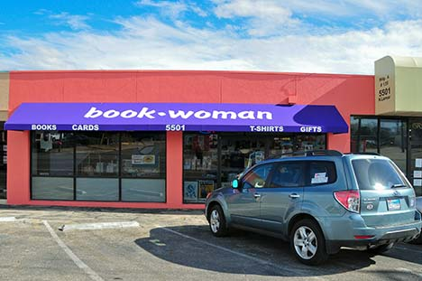
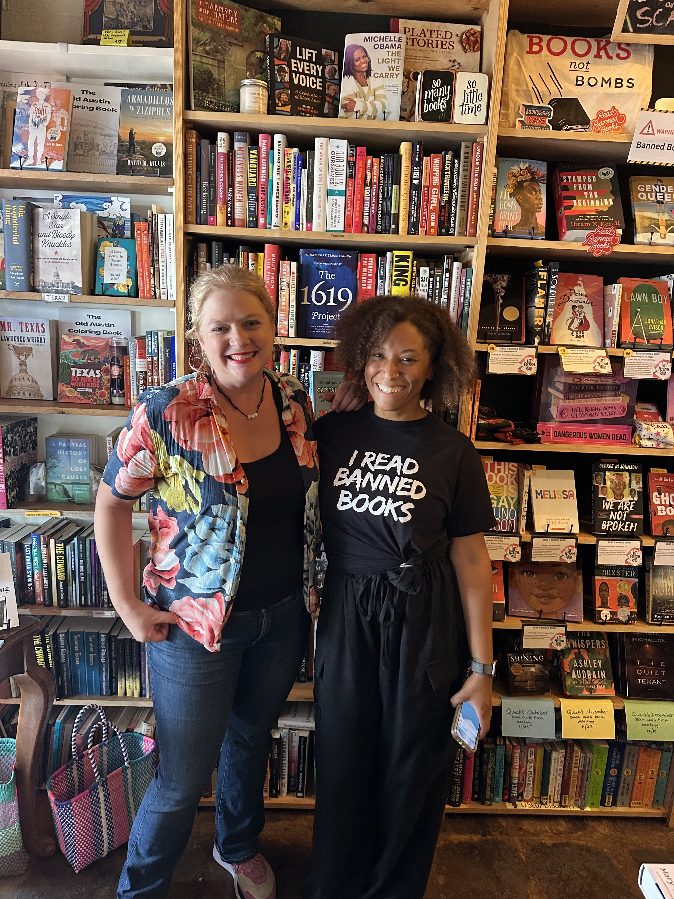
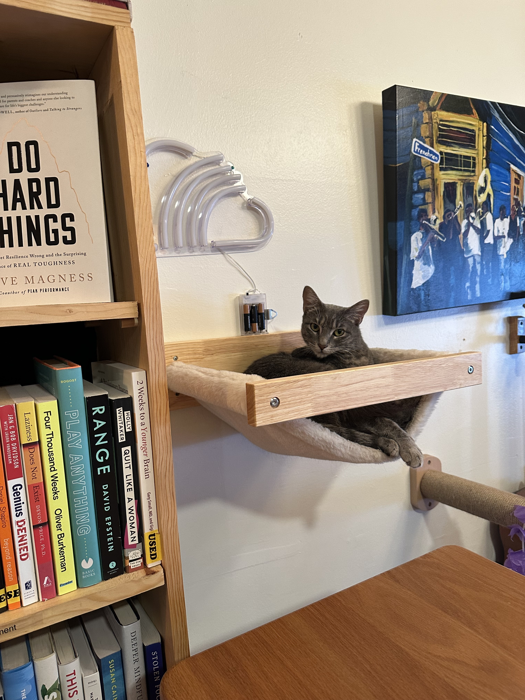
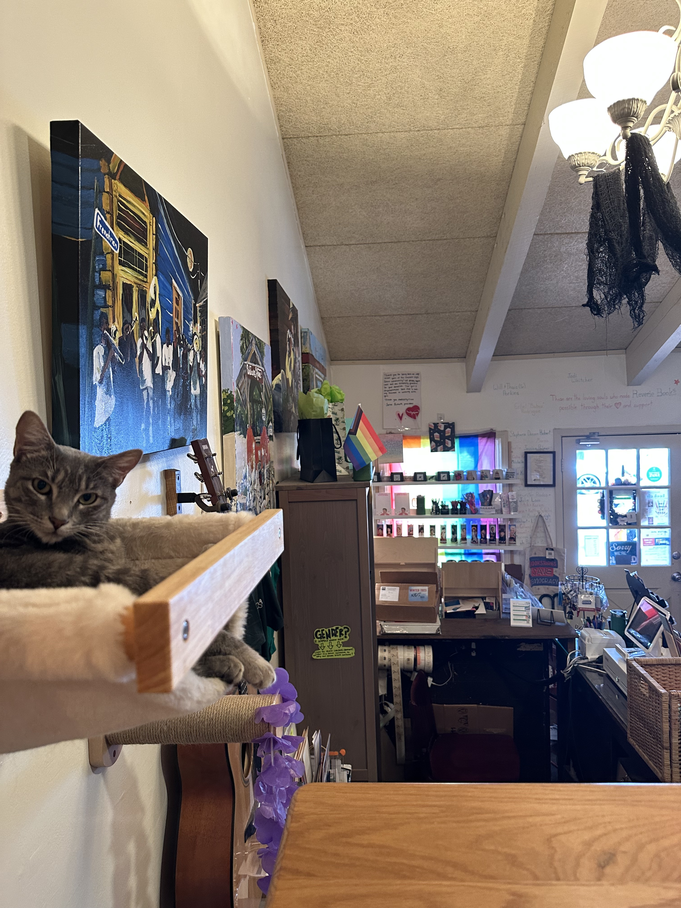
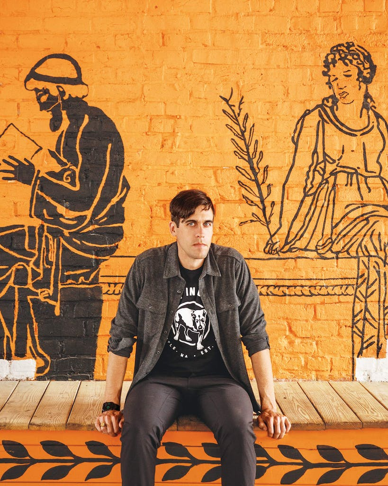

## [**Bookwoman**](https://www.ebookwoman.com/)
Opened 45 years ago on Guadalupe in Central Austin 
One of the best local bookstores that has one of the best selections 
of books on Poetry, LGBTQ, Spirituality, Activism, Politics, Culture, Fiction and more! 
Say Hello to Susana who runs this shop with great Love 
Central Austin 

## [**Reverie Books**](https://reveriebooks.com/)
Another amazing local bookstore! 
Opened during the Pandemic 
Great selection of Banned Books, LGBTQ, Indie, Black History and more! 
5330 Menchaca Rd Ste D 
Say Hello to Thais who runs the shop along with many great events, check out their site! 
South Austin 

## [**The Painted Porch**](https://www.thepaintedporch.com/)
Another bookstore opened during the Pandemic 
Ryan Holiday is an author and speaker who lives in Bastrop 
Check out any of books on stoicism, history, marketing and more!  
One of the best and brightest authors of our times who continues to release bestsellers of the highest quality 
Bastrop Texas 

