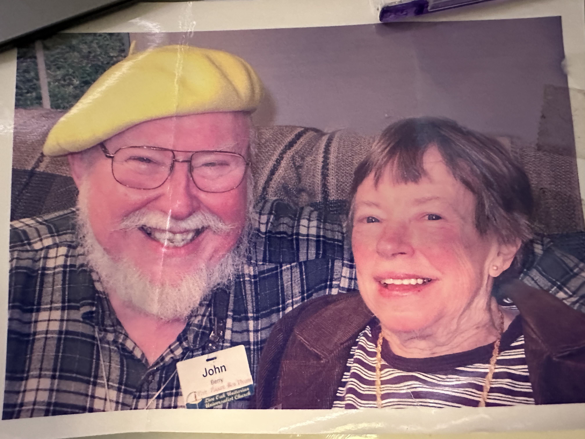
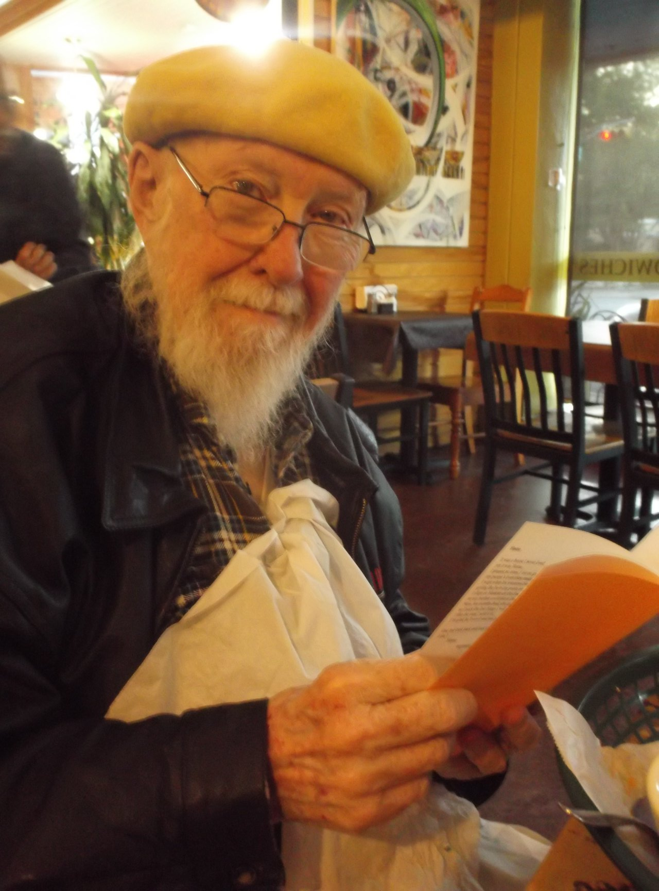
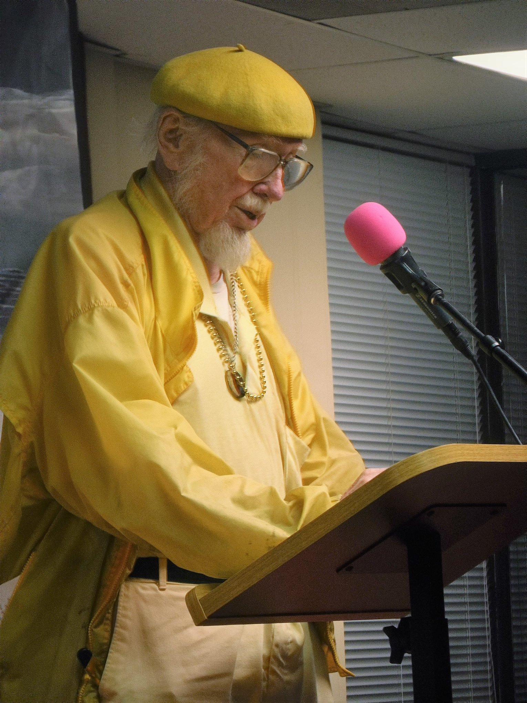

## John Berry

### Great is Diana 

Austin International Poetry Festival 
di-verse-city 2012 Anthology 

Like softly muttering lightning far aview, Nature is beautiful, just look, you'll see —More beautiful than paint or poetry, More beautiful than aught our brains can brew, Than things our recent artists draw or hew, As beautiful as flower to a bee, As spider to the wasp, or wasp to me With orange wings, rest deep metallic blue. 
 
Our arts give beauties echos at their bests, Our best acknowledges the Muse midwife, above all kings, above all Kings of kings, Diana, whose milky-nippled myriad breasts feed every art as well as every life, whose ancient timeless beauty gives birth to all things.

